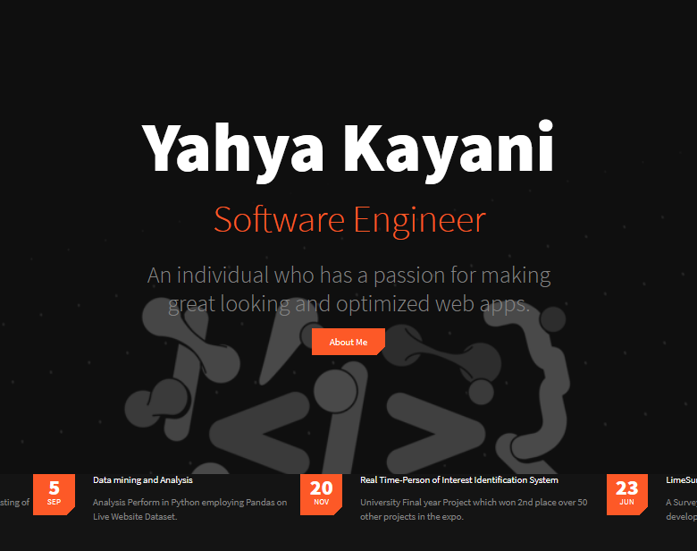
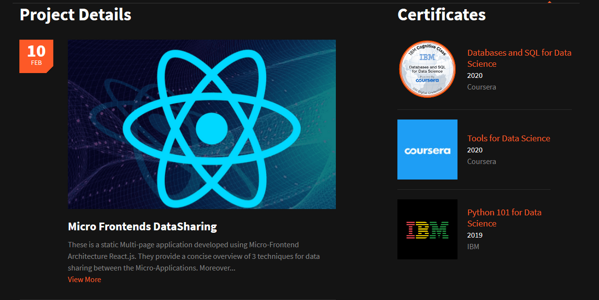
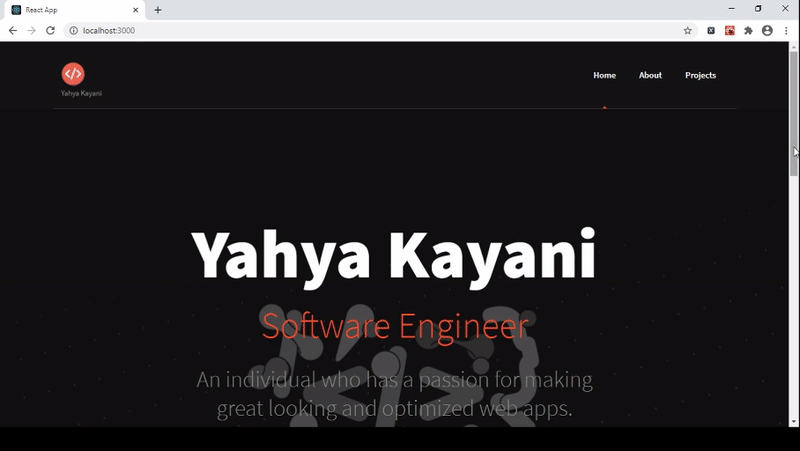

# React Resume Template

[](https://www.codacy.com/app/suddir/suddi-github-io?utm_source=github.com&amp;utm_medium=referral&amp;utm_content=suddi/suddi.github.io&amp;utm_campaign=Badge_Grade)
[](https://stackshare.io/suddi/suddi-github-io)
[](https://github.com/suddi/suddi.github.io/blob/master/LICENSE)

A static Multi-paged application resumer-builder developed using React.js. It uses the Music Band template designed by [Themezy](https://www.themezy.com/), ported over to React.js, and follows a customized version of the [JSON Resume schema](https://jsonresume.org/schema/) along with additional Modifications.

# Views



# Demo


## Installation

````sh
npm install
````

## Usage

To run `webpack-dev-server` for local environment:

````sh
npm run bundle

npm start
````
You can view the site at [`http://localhost:3000`](http://localhost:3000).

To bundle for deployment:

````sh
npm run bundle
````

## Contributing

Welcome :)